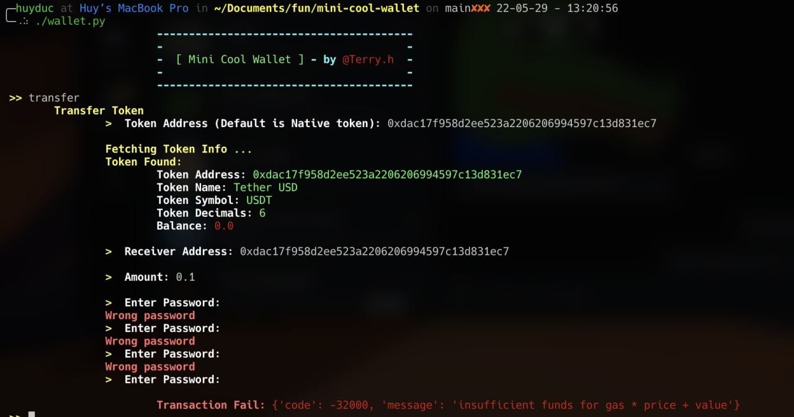

# Mini Cool Wallet
Mini Cool Wallet is python script encrypt your private key. Unlike normal extension wallet, MCW can't connect to browser, so it can't be hack



## Set up
1. Install package
```sh
pip3 install -r requirements.txt

```

2. Execute mod for wallet.py
```sh
chmod 777 ./wallet.py
```

## Usage
1. Run app
```sh
./wallet.py
```

2. Get wallet address
```sh
>> address
```

3. Transfer Token
```sh
>> transfer
```

3. Reset wallet
```sh
>> reset
```

## Thanks for use
Donate ♥  <b>0x094C569ed04f3d93Ac8656e5cf2522381E24D57</b>
